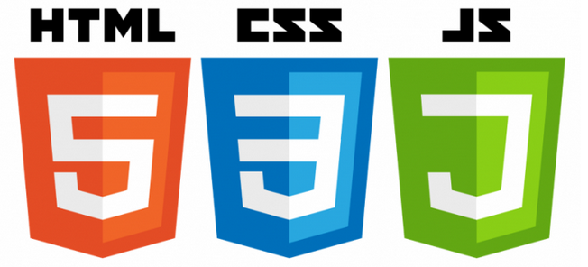

# Uber Clone con android studio y Firebase

## Descripcion 

Curso tomado en la platafoma Udemy

https://www.udemy.com/course/universidad-desarrollo-web-moderno-html-css-javascript-html5-css3/

El mejor curso para aprender a crear aplicaciones Web Modernas con HTML, CSS y JavaScript. Serás un FrontEnd Developer! 

El curso es impartido por Ubaldo Acosta

## Galeria

## Lo que se aprendera 

- Crear aplicaciones Web de Cero a Experto, utilizando HTML, CSS y JavaScript con las últimas versiones al día de hoy!
- Aprenderán absolutamente desde cero HTML, CSS y JavaScript con el objetivo de crear increíbles aplicaciones Web
- Conseguir empleo como FrontEnd Web Developer